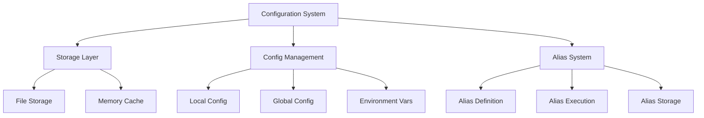

# Configuration System Implementation Plan

## System Overview



## 1. Core Components

### Storage Layer
```go
// config/storage.go
type ConfigStore interface {
    Get(key string) (interface{}, error)
    Set(key string, value interface{}) error
    Delete(key string) error
    List() (map[string]interface{}, error)
}

type FileStore struct {
    path string
    cache map[string]interface{}
    mu sync.RWMutex
}
```

### Configuration Manager
```go
// config/manager.go
type Manager struct {
    global ConfigStore
    local  ConfigStore
    env    EnvProvider
}

type EnvProvider interface {
    Get(key string) string
    Set(key, value string) error
    List() map[string]string
}
```

### Alias System
```go
// config/alias.go
type Alias struct {
    Name        string
    Command     string
    Description string
    Created     time.Time
    Updated     time.Time
}

type AliasManager struct {
    store ConfigStore
}
```

## 2. Implementation Steps

### Phase 2.1: Storage Layer (3-4 days)
1. **File-based Storage**
   - YAML/JSON configuration file format
   - Secure file permissions handling
   - Atomic file writes
   - Change detection and reload

2. **Memory Cache**
   - In-memory configuration cache
   - Cache invalidation strategy
   - Thread-safe operations
   - Performance optimization

### Phase 2.2: Config Management Tools (4-5 days)
1. **Tool Definitions**
   ```go
   // server/config_tools.go
   func configGetToolDef() *protocol.Tool {
       return &protocol.Tool{
           Name: "config_get",
           Description: "Get configuration value",
           Schema: protocol.ToolSchema{
               Properties: map[string]protocol.Property{
                   "key": {Type: "string"},
                   "scope": {Type: "string", Enum: []string{"local", "global"}},
               },
               Required: []string{"key"},
           },
       }
   }
   ```

2. **Tool Handlers**
   - config_get: Retrieve configuration values
   - config_set: Set configuration options
   - config_list: List all configurations
   - config_delete: Remove configuration entries

3. **Configuration Scopes**
   - Global user settings
   - Local repository settings
   - Environment variable integration
   - Scope precedence rules

### Phase 2.3: Alias System (3-4 days)
1. **Alias Management**
   - alias_set: Create/update aliases
   - alias_list: List available aliases
   - alias_delete: Remove aliases
   - alias_exec: Execute alias commands

2. **Alias Storage**
   - Dedicated alias storage file
   - Alias validation rules
   - Command templating support
   - Version control integration

## 3. Testing Strategy

### Unit Tests
```go
// config/storage_test.go
func TestFileStore_SetGet(t *testing.T) {
    // Test basic set/get operations
}

func TestFileStore_Concurrent(t *testing.T) {
    // Test concurrent access
}

// config/manager_test.go
func TestManager_ScopePrecedence(t *testing.T) {
    // Test configuration scope precedence
}

// config/alias_test.go
func TestAliasManager_CreateExecute(t *testing.T) {
    // Test alias creation and execution
}
```

### Integration Tests
- End-to-end configuration workflow tests
- Alias system integration tests
- Cross-platform compatibility tests
- Performance benchmarks

## 4. Documentation

### User Documentation
1. Configuration Commands
   - Usage examples
   - Common configurations
   - Best practices

2. Alias System
   - Creating aliases
   - Using templates
   - Command substitution

### Developer Documentation
1. Architecture Overview
   - Component interactions
   - Data flow diagrams
   - Extension points

2. API Reference
   - Configuration interfaces
   - Storage providers
   - Alias system integration

## 5. Migration Plan

1. **Data Migration**
   - Define config file format version
   - Implement upgrade path
   - Backward compatibility

2. **API Changes**
   - Maintain existing API compatibility
   - Document breaking changes
   - Provide migration guides

## 6. Security Considerations

1. **Data Protection**
   - Secure storage of sensitive data
   - File permission management
   - Environment variable handling

2. **Input Validation**
   - Configuration value validation
   - Alias command validation
   - Path traversal prevention

## Timeline

1. Week 1
   - Storage layer implementation
   - Basic configuration management
   - Initial test coverage

2. Week 2
   - Alias system implementation
   - Tool integration
   - Documentation
   - Integration testing

## Success Criteria

1. **Functionality**
   - All planned tools implemented and tested
   - Configuration system working across platforms
   - Alias system fully functional

2. **Performance**
   - Configuration operations under 100ms
   - Efficient memory usage
   - Minimal disk I/O

3. **Quality**
   - >90% test coverage
   - Zero security vulnerabilities
   - Complete documentation