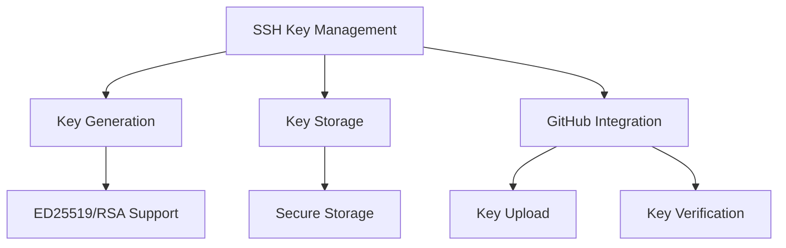
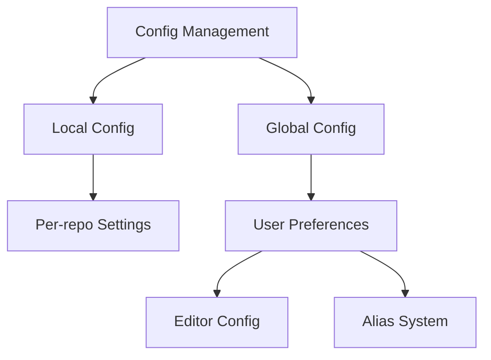
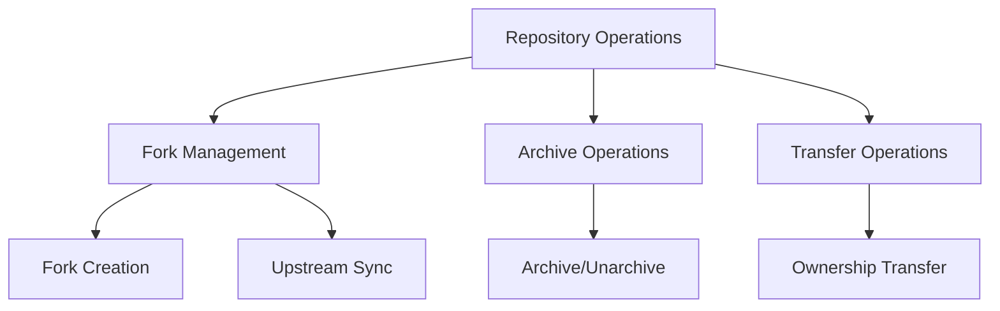

# GitHub MCP Server Implementation Plan - Phase 2

## 1. Complete Authentication & Configuration

### SSH Key Management

#### Components:
1. **SSH Key Tools**
   - `ssh_key_generate`: Generate new SSH key
   - `ssh_key_list`: List SSH keys
   - `ssh_key_add`: Add existing key
   - `ssh_key_delete`: Remove key
   - `ssh_key_verify`: Verify key with GitHub

2. **Key Storage System**
   - Secure key storage implementation
   - Key metadata management
   - Encryption support

### Configuration System

#### Components:
1. **Configuration Tools**
   - `config_get`: Get config value
   - `config_set`: Set config value
   - `config_list`: List configurations
   - `config_delete`: Delete config

2. **Alias System**
   - `alias_set`: Create new alias
   - `alias_list`: List aliases
   - `alias_delete`: Remove alias
   - `alias_exec`: Execute alias command

## 2. Enhanced Repository Management

### Advanced Repository Operations

#### Components:
1. **Fork Management Tools**
   - `repo_fork`: Fork repository
   - `repo_sync`: Sync with upstream
   - `repo_fork_list`: List forks

2. **Repository Admin Tools**
   - `repo_archive`: Archive/unarchive repository
   - `repo_transfer`: Transfer ownership
   - `repo_rename`: Rename repository
   - `repo_visibility`: Change visibility

3. **Repository Settings Tools**
   - `repo_settings_update`: Update repository settings
   - `repo_features`: Enable/disable repository features
   - `repo_branch_default`: Set default branch
   - `repo_topics`: Manage repository topics

## Implementation Order

1. Configuration System (1-2 weeks)
   - Implement config storage system
   - Add config management tools
   - Create alias system
   - Add tests and documentation

2. SSH Key Management (1-2 weeks)
   - Implement secure key storage
   - Add key management tools
   - Add GitHub integration
   - Add tests and documentation

3. Advanced Repository Features (2-3 weeks)
   - Implement fork operations
   - Add archive/transfer capabilities
   - Add repository settings tools
   - Add tests and documentation

## Technical Considerations

1. **Security**
   - Secure storage for SSH keys
   - Encryption for sensitive config data
   - Proper permission handling

2. **Data Storage**
   - Config file format and location
   - Key storage structure
   - Backup considerations

3. **API Integration**
   - GitHub API rate limiting
   - Error handling
   - Pagination support

4. **Testing**
   - Unit tests for each component
   - Integration tests
   - Security testing
   - Performance testing

## Dependencies

1. **External Libraries**
   - OpenSSH for key generation
   - Encryption libraries
   - YAML/JSON parsers

2. **GitHub API Requirements**
   - Repository management permissions
   - Admin access for certain operations
   - Rate limit considerations

## Risks and Mitigation

1. **Security Risks**
   - Secure key storage implementation
   - Regular security audits
   - Clear security documentation

2. **Performance Risks**
   - Efficient config loading
   - Caching where appropriate
   - Rate limit handling

3. **Compatibility Risks**
   - Cross-platform support
   - GitHub API version changes
   - Backward compatibility