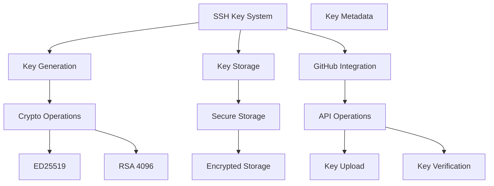
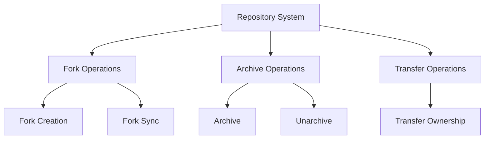

# GitHub MCP Server Implementation Plan - Phase 3

## 1. SSH Key Management

### System Overview


### Components

1. **SSH Key Interface**
```go
// ssh/key.go
type SSHKey struct {
    ID          string    `json:"id"`
    Name        string    `json:"name"`
    Type        string    `json:"type"`    // ed25519 or rsa
    PublicKey   string    `json:"public_key"`
    PrivateKey  []byte    `json:"private_key"`
    Fingerprint string    `json:"fingerprint"`
    Added       time.Time `json:"added"`
    LastUsed    time.Time `json:"last_used,omitempty"`
}

type SSHKeyManager interface {
    Generate(name string, keyType string) (*SSHKey, error)
    Import(name string, privateKey []byte) (*SSHKey, error)
    List() ([]*SSHKey, error)
    Get(id string) (*SSHKey, error)
    Delete(id string) error
    UploadToGitHub(keyID string) error
}
```

2. **Encryption Layer**
```go
// ssh/crypto.go
type KeyEncryption interface {
    Encrypt(data []byte) ([]byte, error)
    Decrypt(data []byte) ([]byte, error)
}

type SSHKeyGen interface {
    GenerateED25519() (*SSHKey, error)
    GenerateRSA(bits int) (*SSHKey, error)
    ImportKey(privateKey []byte) (*SSHKey, error)
}
```

3. **Storage System**
```go
// ssh/storage.go
type KeyStore interface {
    Save(key *SSHKey) error
    Load(id string) (*SSHKey, error)
    List() ([]*SSHKey, error)
    Delete(id string) error
}
```

### Implementation Steps

1. **Core SSH Functionality** (3-4 days)
   - Implement key generation (ED25519/RSA)
   - Add key import functionality
   - Create key fingerprinting
   - Add key format validation

2. **Secure Storage** (2-3 days)
   - Implement encrypted storage
   - Add key metadata handling
   - Create backup functionality
   - Handle key permissions

3. **GitHub Integration** (2-3 days)
   - Add key upload to GitHub
   - Implement key verification
   - Handle API rate limits
   - Add error handling

## 2. Advanced Repository Operations

### System Overview


### Components

1. **Fork Management**
```go
// github/fork.go
type ForkOptions struct {
    Organization string
    Name         string
    DefaultBranch string
    Private      bool
}

type ForkManager interface {
    CreateFork(owner, repo string, opts *ForkOptions) error
    SyncFork(owner, repo string) error
    ListForks(owner, repo string) ([]*Repository, error)
}
```

2. **Repository Admin**
```go
// github/admin.go
type AdminOperations interface {
    Archive(owner, repo string) error
    Unarchive(owner, repo string) error
    Transfer(owner, repo, newOwner string) error
    UpdateSettings(owner, repo string, settings *RepoSettings) error
}
```

3. **Repository Settings**
```go
// github/settings.go
type RepoSettings struct {
    DefaultBranch string
    Private       bool
    AllowMergeCommit bool
    AllowSquashMerge bool
    AllowRebaseMerge bool
    DeleteBranchOnMerge bool
    EnableIssues bool
    EnableProjects bool
    EnableWiki bool
}
```

### Implementation Steps

1. **Fork Operations** (3-4 days)
   - Implement fork creation
   - Add fork synchronization
   - Create fork listing
   - Handle fork settings

2. **Archive Operations** (2-3 days)
   - Implement archive/unarchive
   - Add safety checks
   - Create confirmation system
   - Handle webhook notifications

3. **Transfer Operations** (2-3 days)
   - Implement ownership transfer
   - Add permission checks
   - Create transfer verification
   - Handle transfer notifications

## Testing Strategy

1. **Unit Tests**
   - Test key generation and validation
   - Test storage encryption/decryption
   - Test repository operations
   - Test error conditions

2. **Integration Tests**
   - Test GitHub API integration
   - Test key upload and verification
   - Test fork operations
   - Test archive/transfer operations

3. **Security Tests**
   - Test key storage security
   - Test permission handling
   - Test data encryption
   - Test API token handling

## Timeline

1. Week 1-2: SSH Key Management
   - Days 1-4: Core SSH functionality
   - Days 5-7: Secure storage
   - Days 8-10: GitHub integration

2. Week 3-4: Advanced Repository Operations
   - Days 1-4: Fork operations
   - Days 5-7: Archive operations
   - Days 8-10: Transfer operations

## Success Criteria

1. **SSH Key Management**
   - Secure key generation and storage
   - Successful GitHub key integration
   - Proper encryption of sensitive data
   - Comprehensive key management tools

2. **Repository Operations**
   - Reliable fork operations
   - Safe archive/unarchive functionality
   - Secure transfer operations
   - Proper error handling and validation

## Dependencies

1. Crypto Libraries
   - golang.org/x/crypto/ssh
   - golang.org/x/crypto/ed25519
   - github.com/golang/crypto

2. GitHub API Requirements
   - SSH key management endpoints
   - Repository management permissions
   - Fork API access
   - Transfer API access