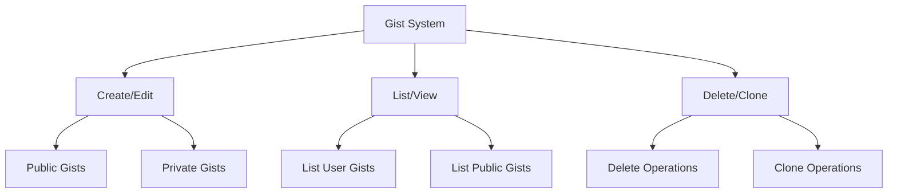
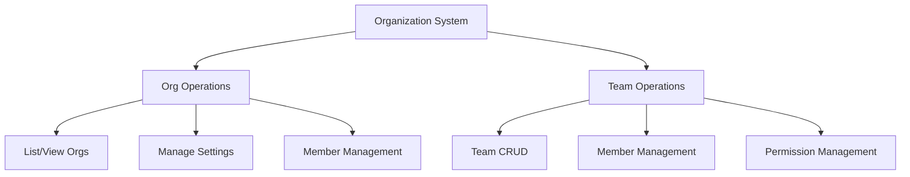
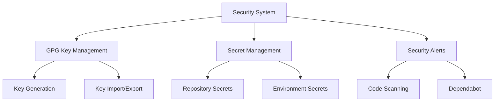

# GitHub MCP Server Implementation Plan - Phase 4

## 1. Gist Management

### System Overview


### Components

1. **Gist Interface**
```go
// gist/gist.go
type Gist struct {
    ID          string
    Description string
    Public      bool
    Files       map[string]GistFile
    Owner       string
    CreatedAt   time.Time
    UpdatedAt   time.Time
    HTMLURL     string
}

type GistFile struct {
    Content  string
    Language string
    Size     int
    RawURL   string
}

type GistManager interface {
    Create(description string, files map[string]string, public bool) (*Gist, error)
    List() ([]*Gist, error)
    Get(id string) (*Gist, error)
    Update(id string, description string, files map[string]string) error
    Delete(id string) error
    Clone(id string, directory string) error
}
```

2. **GitHub API Integration**
```go
// github/gists.go
func (c *Client) CreateGist(...)
func (c *Client) ListGists(...)
func (c *Client) GetGist(...)
func (c *Client) UpdateGist(...)
func (c *Client) DeleteGist(...)
```

## 2. Organization & Team Management

### System Overview


### Components

1. **Organization Interface**
```go
// org/organization.go
type Organization struct {
    ID          int64
    Login       string
    Name        string
    Description string
    HTMLURL     string
    Settings    OrgSettings
}

type OrgSettings struct {
    DefaultRepoPermission string
    MembersCanCreateRepos bool
    TwoFactorRequired     bool
}

type OrgManager interface {
    List() ([]*Organization, error)
    Get(name string) (*Organization, error)
    UpdateSettings(name string, settings *OrgSettings) error
    ListMembers(name string) ([]*Member, error)
    AddMember(org, user string, role string) error
    RemoveMember(org, user string) error
}
```

2. **Team Interface**
```go
// org/team.go
type Team struct {
    ID          int64
    Name        string
    Slug        string
    Description string
    Permission  string
    Parent      *Team
}

type TeamManager interface {
    Create(org string, name string, params *TeamParams) (*Team, error)
    List(org string) ([]*Team, error)
    Get(org string, team string) (*Team, error)
    Update(org string, team string, params *TeamParams) error
    Delete(org string, team string) error
    AddMember(org string, team string, username string) error
    RemoveMember(org string, team string, username string) error
    ListRepos(org string, team string) ([]*Repository, error)
    AddRepo(org string, team string, repo string) error
    RemoveRepo(org string, team string, repo string) error
}
```

## 3. Security Features

### System Overview


### Components

1. **GPG Key Management**
```go
// security/gpg.go
type GPGKey struct {
    ID          string
    KeyID       string
    PublicKey   string
    Fingerprint string
    Email       string
    CreatedAt   time.Time
}

type GPGManager interface {
    Generate(name string, email string) (*GPGKey, error)
    Import(key string) (*GPGKey, error)
    List() ([]*GPGKey, error)
    Delete(keyID string) error
}
```

2. **Secret Management**
```go
// security/secrets.go
type Secret struct {
    Name           string
    CreatedAt      time.Time
    UpdatedAt      time.Time
    Visibility     string
    SelectedRepos  []string
}

type SecretManager interface {
    Create(name string, value string, visibility string) error
    Update(name string, value string) error
    Delete(name string) error
    List() ([]*Secret, error)
    SetVisibility(name string, visibility string, repos []string) error
}
```

3. **Security Alerts**
```go
// security/alerts.go
type SecurityAlert struct {
    ID          int64
    Type        string
    State       string
    Severity    string
    Description string
    CreatedAt   time.Time
    ResolvedAt  time.Time
}

type AlertManager interface {
    ListCodeScanningAlerts() ([]*SecurityAlert, error)
    ListDependabotAlerts() ([]*SecurityAlert, error)
    DismissAlert(id int64, reason string) error
    ResolveAlert(id int64) error
}
```

## Implementation Timeline

1. Week 1: Gist Management (3-4 days)
   - Implement gist operations
   - Add GitHub API integration
   - Create tests
   - Add documentation

2. Week 2: Organization & Team Management (4-5 days)
   - Implement organization operations
   - Implement team operations
   - Add member management
   - Create tests
   - Add documentation

3. Week 3: Security Features (4-5 days)
   - Implement GPG key management
   - Add secret management
   - Implement security alerts
   - Create tests
   - Add documentation

## Success Criteria

1. Gist Management
   - Full CRUD operations for gists
   - Support for public/private gists
   - Clone functionality
   - Proper error handling

2. Organization & Team Management
   - Complete organization operations
   - Full team management
   - Member management
   - Permission handling
   - Repository access control

3. Security Features
   - GPG key management
   - Secret management with visibility control
   - Security alert integration
   - Documentation and examples

## Dependencies

1. External Libraries
   - gpgme for GPG operations
   - encryption libraries
   - git for cloning

2. GitHub API Requirements
   - Organization admin scope
   - Team management scope
   - Security events scope
   - Secret management scope