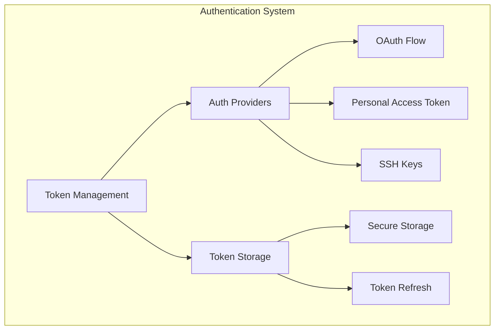
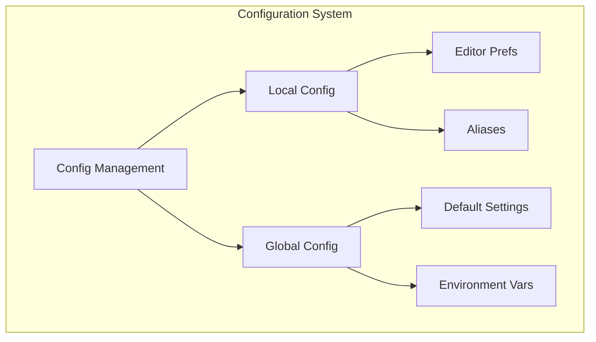

# GitHub MCP Server Implementation Plan

## Phase 1: Authentication & Configuration

### 1. Authentication System



#### Components

1. **Auth Providers**
   - OAuth Flow Provider
   - Personal Access Token Provider
   - SSH Key Provider
   - Environment Variable Support

2. **Token Management**
   - Secure Token Storage
   - Token Refresh Mechanism
   - Multiple Token Support
   - Token Scopes Management

3. **SSH Key Management**
   - Key Generation
   - Key Registration
   - Key Removal
   - Multiple Key Support

### 2. Configuration System



#### Components

1. **Config Management**
   - Local Repository Config
   - Global User Config
   - Environment Variables
   - Configuration Hierarchy

2. **Alias System**
   - Custom Command Aliases
   - Alias CRUD Operations
   - Alias Validation
   - Command Expansion

## Implementation Steps

### 1. Authentication Enhancement (auth_tools.go)

```go
// Tool Definitions
type AuthLoginTool struct {
    Method     string   // "oauth", "token", "ssh"
    Scopes     []string // Required permission scopes
    TokenStore Storage  // Secure token storage
}

type AuthLogoutTool struct {
    Method     string  // Specific auth method to logout from
    RemoveKeys bool    // Whether to remove SSH keys
}

type TokenManagementTool struct {
    Operation string // "create", "list", "delete", "refresh"
    Scope     string // Token scope
}

type SSHKeyManagementTool struct {
    Operation string // "create", "list", "delete"
    KeyType   string // "rsa", "ed25519"
    KeyName   string
}
```

### 2. Configuration System (config_tools.go)

```go
// Tool Definitions
type ConfigGetTool struct {
    Key      string // Config key to retrieve
    Scope    string // "local", "global"
}

type ConfigSetTool struct {
    Key      string // Config key to set
    Value    string // Config value
    Scope    string // "local", "global"
}

type AliasManagementTool struct {
    Operation string // "set", "get", "list", "delete"
    Name      string // Alias name
    Command   string // Alias command
}

type EnvManagementTool struct {
    Operation string // "set", "get", "list", "delete"
    Name      string // Environment variable name
    Value     string // Environment variable value
}
```

### 3. Storage Layer (storage/auth.go)

```go
// Interfaces
type SecureTokenStore interface {
    StoreToken(token *Token) error
    GetToken(id string) (*Token, error)
    ListTokens() ([]*Token, error)
    DeleteToken(id string) error
}

// Implementations
type FileSystemStore struct {
    BasePath string
    Encrypt  bool
}

type EncryptedStore struct {
    Store    SecureTokenStore
    KeyRing  KeyringManager
}
```

### 4. OAuth Implementation (auth/oauth.go)

```go
// Interfaces
type OAuthProvider interface {
    InitiateFlow(scopes []string) (string, error)
    ExchangeCode(code string) (*Token, error)
    RefreshToken(token *Token) (*Token, error)
}

// Implementation
type GitHubOAuthProvider struct {
    ClientID     string
    ClientSecret string
    RedirectURI  string
    Store        SecureTokenStore
}
```

## Implementation Order

1. Storage Layer
   - Implement secure token storage
   - Add encryption support
   - Create storage tests

2. Authentication Tools
   - Implement basic token management
   - Add OAuth flow support
   - Add SSH key management
   - Create authentication tests

3. Configuration System
   - Implement config management
   - Add alias support
   - Add environment variable handling
   - Create configuration tests

4. Integration
   - Connect components
   - Add e2e tests
   - Document usage